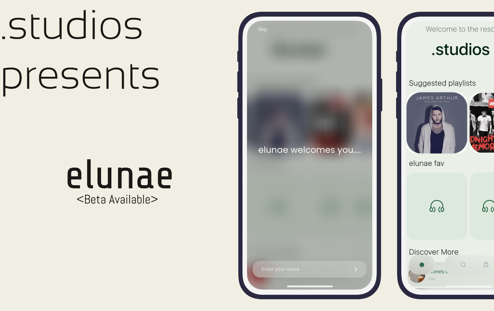
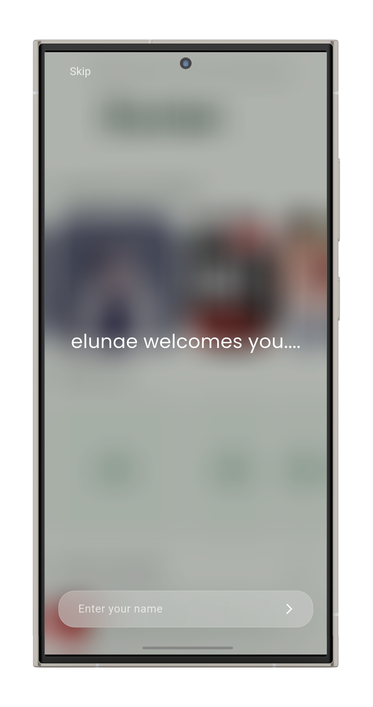
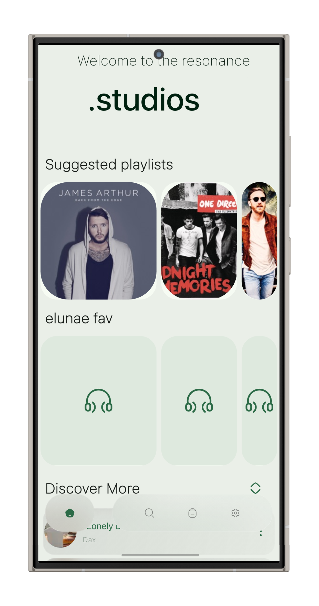
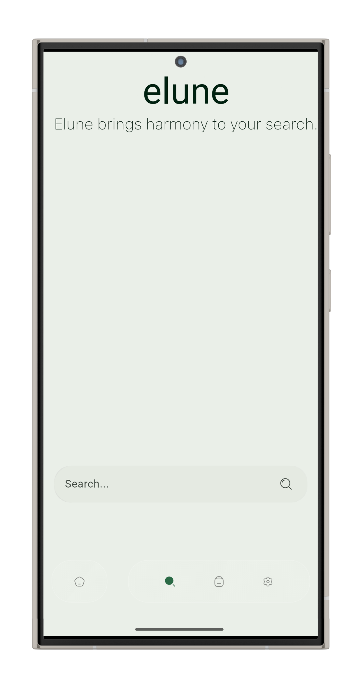
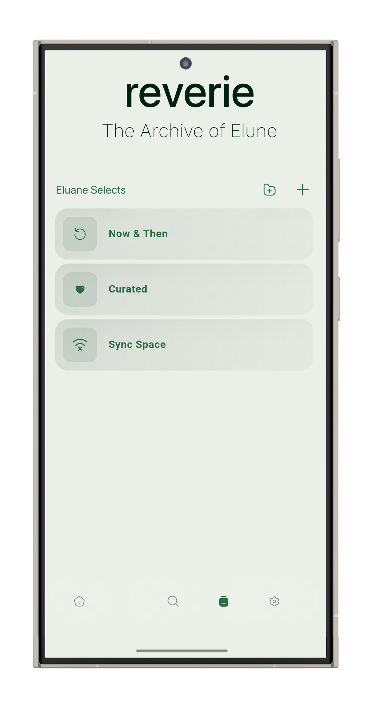
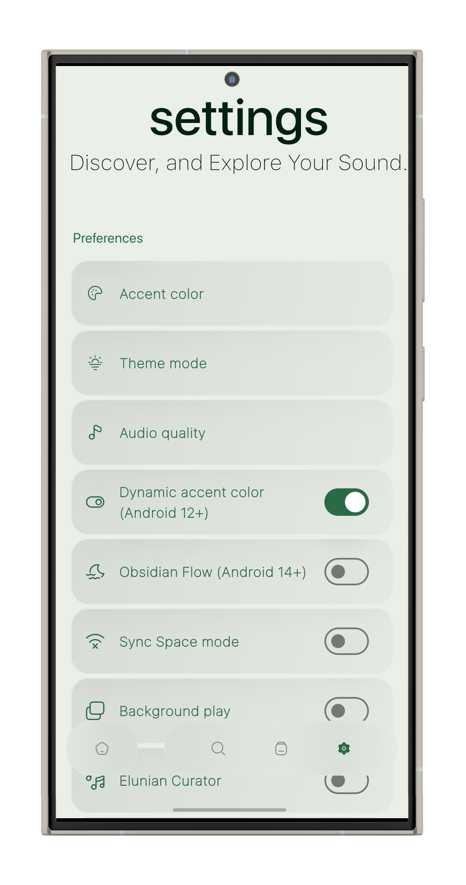

# 🎧 Eluane – Minimal. Intelligent. Yours.



**Eluane** is a sleek, modern, and predictive offline music player developed in Flutter by [DotStudios](https://github.com/your-username). Eluane reimagines the local music experience with iOS-inspired aesthetics, glassmorphic design, and a personalized recommendation engine — built to feel intuitive, smooth, and emotional.

Whether you're an audiophile or a casual listener, Eluane is designed to let your music take center stage, without clutter or distractions.

---

## ✨ Key Features

### 🔮 Intelligent Music Recommendation
Eluane features a custom-built predictive engine that learns what you like and suggests what you'll love. The more you listen, the better it gets — curating music based on your skips, replays, time of day, and mood patterns.

### 🌙 Dynamic & Themed UI
From dynamic Material You support on Android 12+ to a beautiful dark/light adaptive interface, Eluane blends with your device effortlessly. Colors change based on album art, time, or even your system settings.

### 💠 Glassmorphic Design
Inspired by iOS 17 and modern Apple design language, Eluane uses glass blur, soft shadows, smooth animations, and minimalist typography to bring a futuristic feel without losing simplicity.

### 🎵 Focused Local Music Player
Eluane is optimized for **offline playback** — scan your device, organize songs, play by artists, albums, genres, and playlists — all locally. No accounts, no cloud dependency.

### 📁 Organized Music Library
Your songs, organized the way you like — cleanly grouped by:
- 🎙 Artists
- 💽 Albums
- 🎚 Genres
- 📝 Playlists (create, edit, delete)
- 🔍 Smart Search

### 🎛️ Audio Engine Powered by Flutter
- Smooth background playback
- Notification controls
- Headphone unplug/plug handling
- Audio focus support
- Background queue management

---

## 🖼 Screenshots
## 📸 App Screenshots

## 📸 App Screenshots

| Splash                              | Home                              | Search                              | Playlist                              | Settings                              |
|-------------------------------------|-----------------------------------|-------------------------------------|---------------------------------------|---------------------------------------|
|  |  |  |  |  |

---

## 🚀 Getting Started

### Prerequisites

- Flutter 3.19+
- Dart SDK
- Android/iOS device or emulator
- Git

### 1. Clone the repository

```bash
git clone https://github.com/your-username/eluane.git
cd eluane
